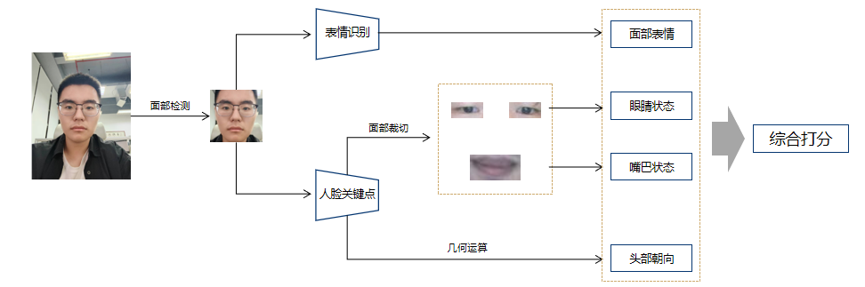
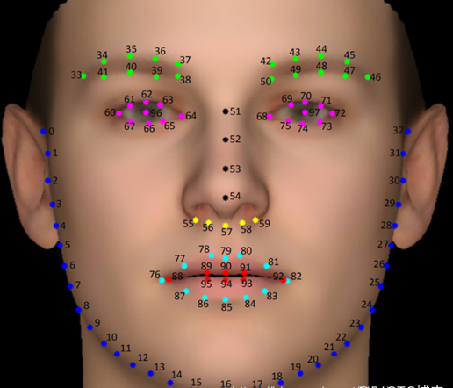
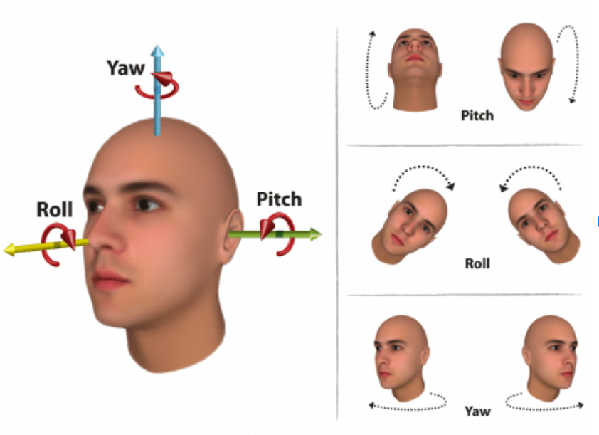
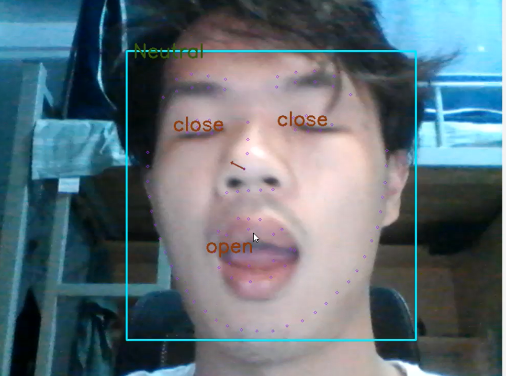
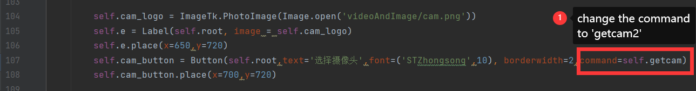
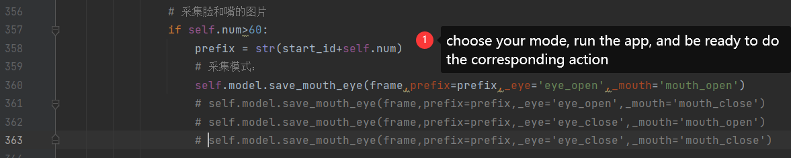
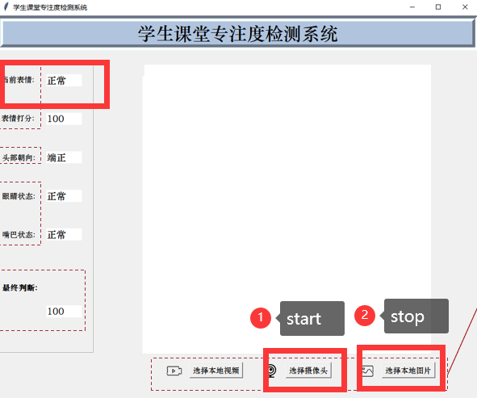

## About this repo
We have developed a small application, which uses face detection, 
landmarks of face, head posture, emotion recognition and other technologies to judge 
students' class status. It was both a course assignment and a simple
application of AI.

## What can this app do?
Detect a face, classify the emotion, determine if the mouth 
is open or the eyes are closed and calculate the head pose(or direction):\

### face detection, face landmarks and head pose:
These modules are based on https://github.com/WIKI2020/FacePose_pytorch, and you may interested of it.

#### face landmarks
98 landmarks are regressed by a CNN based network:\

#### head pose
The head pose is represent by a three 
dimensional direction vector: (pitch, yaw, roll) as show below:\

And it is calculated by the 2d geometry relation of these landmarks
#### eye and mouth
we clip the area of eye and mouth to train two network for eye's status
and mouth's status judgement. \

## Try yourself
### enviroment requirment
**Base evironment**\
window10+Anaconda

**And other python package:**\
pytorch\
torchvision\
opencv-python\
tkinter\
mmcv

_cuda is not necessary, but prefered._

### run and try:
`python paint.py`\

### mouth and eye dataset: More data
We have a potential method to get more data with your camera for mouth and eye classifier training
if you want to train the model with your own mouth and eye, and it's easy:

1. change the camera event:\

2. run the app and cap your data:\

click "选择摄像头" to start capturing, The capturing automatically starts when the number 
of components in the upper right corner reaches 60, and stops manually by click "选择本地图片".\

3. mask sure capture your eye and mouth in different angles and distance etc. And don't ask me how to 
manually stop the capturing while closing your eyes.
4. you should run the app 4 times for 4 different. and the output pictures will be saved in './data' folder.

